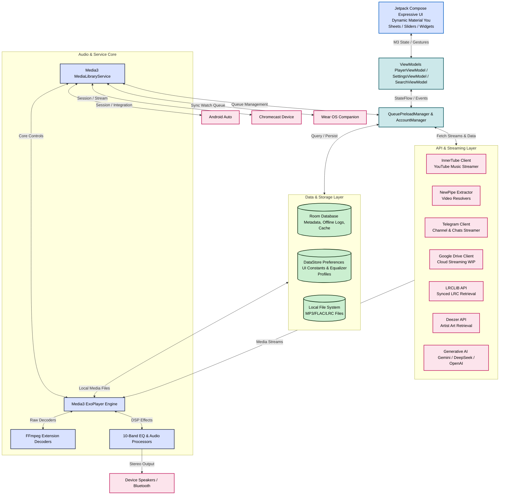

# Pixel Music 🎵

<p align="center">
  
</p>

<p align="center">
  <strong>The Ultimate Hybrid Local, Streaming, and Cloud Music Powerhouse for Android</strong><br>
  An elegant, feature-rich audio system built using Jetpack Compose, Material Design 3, and Media3 ExoPlayer.
</p>

<p align="center">
  
  
  
  
</p>

<p align="center">
  <a href="https://android.com"></a>
  <a href="https://kotlinlang.org"></a>
  <a href="LICENSE"></a>
  <a href="https://t.me/PixelMusicApp"></a>
  <a href="https://github.com/ianshulyadav/PixelMusic"></a>
</p>

> [!NOTE]
> **Independent Fork & Attribution Notice:** This repository is an independent, community-driven fork of the excellent open-source project **[PixelPlayer](https://github.com/theovilardo/PixelPlayer)** created by **[Theo Vilardo](https://github.com/theovilardo)**. It is modified and distributed under the terms of the [Proprietary License](LICENSE). We extend our sincere gratitude to Theo Vilardo and all original contributors for their outstanding foundation work.

---

## 📖 Introduction & Philosophy

**Pixel Music** is not just another music player. It is a unified, privacy-first audio powerhouse engineered for audiophiles, cloud hoarders, and streaming enthusiasts alike. By bridging local offline library indexing, unofficial YouTube Music streaming, Telegram channel integration, Google Drive personal cloud libraries (WIP), and next-generation Generative AI capabilities, Pixel Music creates a flawless hybrid music ecosystem under a single, gorgeous user experience.

**Pixel Music** is the ultimate hybrid local and yt music client built for Android. It represents a gorgeous, open-source Spotify and YT Premium alternative. This application brings all of your music sources under a single, beautiful roof.

You can scan and play high-resolution local files like FLAC, ALAC, WAV, and MP3. At the same time, you can stream the entire YouTube Music catalog without advertisements. Additionally, you can connect your Telegram account to stream audio directly from channels, chats, and saved files.

Beautifully styled on the state-of-the-art **PixelPlayer** UI/UX, the interface adapts dynamically to the colors of your album artwork. The app is loaded with advanced features. You can follow along with synchronized LRC lyrics (complete with manual timing offset adjustments). You can customize your sound with a professional 10-band equalizer. You can also connect to other systems using built-in Chromecast, full Android Auto driving support, and a Wear OS watch companion.

The app even includes custom generative AI playlist creation. You can simply describe a mood or style, and the built-in Gemini assistant will instantly curate the perfect queue for you. Released under the Proprietary License, Pixel Music provides a highly premium, privacy-focused, and completely unrestricted audio experience.

---

## ⚡ The Ultimate Comparative Advantage

Pixel Music incorporates the best concepts of open-source streaming clients and elevates them with offline power, premium styling, and AI. Here is how Pixel Music compares to other elite Android audio projects:

| Feature Dimension | **OpenTune** | **Metrolist** | **ArchiveTune** | **Pixel Music 🎵 (This App)** |
|:---|:---:|:---:|:---:|:---:|
| **Core Concept** | YouTube Music Streaming | YouTube Music Streaming | YT Music & Local Hybrid | **Ultimate Hybrid (Local, YT Music, Telegram, Google Drive)** |
| **Visual Aesthetics** | Classic Material 3 | Dynamic M3 (Utility-focused) | Material 3 Utility | **State-of-the-Art Expressive UI** (Vibrant, glassmorphism, fluid micro-interactions) |
| **Dynamic Coloring** | Standard Material You | Basic Album Color Sync | Basic Album Color Sync | **Adaptive Palette Extraction** (Dynamic player background, expressive list tiles) |
| **Audio Core** | ExoPlayer | ExoPlayer + Normalization | ExoPlayer + R128 | **Media3 ExoPlayer + FFmpeg Decoders + 10-Band EQ** |
| **Lyrics Pipeline** | LRCLIB (Sync) | LRCLIB + Romanization | LRCLIB + Translation | **LRCLIB + Dynamic Offset Sync + Offline caching + manual search** |
| **AI Integration** | None | None | None | **Generative AI Playlist Creator** (Gemini, DeepSeek, OpenAI support) |
| **Connectivity** | Background Play | Cast, Sleep Timer | Scrobble, Cast | **Android Auto, Chromecast, Wear OS, Last.fm & ListenBrainz** |
| **Legal/License Safety** | GPL-3.0 | GPL-3.0 | GPL-3.0 | **Proprietary (Personal, non-commercial use only)** |

---

## 🗺️ System & Architectural Blueprint

Pixel Music's architecture uses clean MVVM patterns. The flow of audio, synchronization, caching, and state displays as follows:



---

## 🎨 UI/UX Excellence: A Tribute to PixelPlayer

Pixel Music's high-fidelity interface is proudly inspired by and built upon the open-source aesthetic foundation of **[PixelPlayer](https://github.com/theovilardo)**. 

> [!NOTE]
> We extend our deepest credit and gratitude to **[PixelPlayer](https://github.com/theovilardo/PixelPlayer)** (crafted by **Theo Vilardo**) for redefining what a native Android application can look like. 

Key UI/UX visual paradigms adopted from PixelPlayer include:
* **Dynamic Material You Theming:** High-precision HSL color extraction from album artwork that smoothly updates the player, bottom sheets, sliders, and navigation bar to match the mood of the current track.
* **Fluid Micro-Animations:** Seamless screen Transitions, predictive back-swipe handling, physics-based scroll bars, and springy gesture-driven mini-players.
* **Premium Expressive Sliders:** Custom smooth-corner sliders and elegant volume control sheets that respond naturally to user touch.
* **State-of-the-Art Widgets:** Material 3 Glance home-screen widgets providing deep in-context customization and interactive controls directly from your launcher.

---

## ✨ Exhaustive Features List

### 🎵 1. Premium Audio Architecture
* **Advanced Media3 Engine:** Powered by Android's modern `androidx.media3.exoplayer` framework with customized caching pipelines.
* **FFmpeg Decoding Extension:** Native FFmpeg decoding libraries packed directly into the APK, enabling full compatibility for high-resolution formats like lossless **FLAC**, ALAC, WAV, APE, OPUS, OGG, and legacy MP3.
* **Professional 10-Band Equalizer:** High-fidelity hardware equalizer built in, including custom presets (Bass Booster, Vocal, Treble, Classical, etc.), bass boost, spatial virtualizer, and loudness enhancer.
* **Smart Volume Normalization:** Integration of EBU R128 loudness normalization algorithm to keep volume levels perfectly consistent across all local and streaming sources.
* **Seamless Audio Transitions:** Fully configurable crossfade (0s - 15s) and gapless playback engines to remove irritating pauses between tracks.

### 🌐 2. Ultimate Hybrid Streaming Capabilities
* **Unofficial YouTube Music Client:** Search the entire YouTube Music catalog, stream audio in high quality, and access curated mixes without advertisements.
* **Secure Account Synchronization:** Securely sign into your YouTube Music account via a premium WebView container to sync your liked tracks, custom playlists, and subscribed artists.
* **Telegram Audio Pipeline:** Connect your Telegram account to directly stream and catalog music uploaded to your channels, chats, and saved messages.
* **Google Drive Integration (WIP):** Stream high-resolution personal audio libraries directly from cloud folders without taking up local storage.
* **Deezer Artist Artwork:** Dynamic querying of the Deezer API to auto-fetch high-quality cover art and backgrounds for all cataloged artists.

### 🎤 3. Real-Time Lyrics Pipeline
* **High-Precision LRC Engine:** Automated lyrics fetching using the LRCLIB API to display fully synchronized, scrolling lyrics.
* **Manual Lyrics Offset Search:** Refine synchronization timing offsets (millisecond granularity) if the text does not line up perfectly with the audio.
* **Offline Caching:** Lyrics are cached in the local Room database to ensure synchronization is preserved even when offline.
* **Live Translation & Romanization:** Translate foreign lyrics on the fly or view Romanized versions for easier listening (inspired by ArchiveTune's lyrics workflow).

### 🧠 4. Generative AI Playlists
* **AI Music Assistant:** Feed custom prompts (e.g., *"Make a high-intensity workout mix of synthwave and phonk"* or *"A rainy Sunday morning acoustic playlist"*) to generate highly personalized listening queues.
* **Multiple Model Support:** Integrates with Google Gemini, DeepSeek, OpenAI, and custom API proxies to let you choose your favorite LLM backend.

### 📲 5. Connectivity & Companion Ecosystem
* **Full Android Auto Support:** Fully compliant Android Auto integration leveraging Media3's robust `MediaLibraryService` for safe, simplified driving interfaces.
* **Chromecast Integration:** Cast local files and streaming media seamlessly to smart TVs, Chromecast dongles, and Nest speakers.
* **Wear OS Companion App:** High-performance Wear OS client that supports independent watch playback, queue transfers, local offline watch caching, and remote control of your phone's player.
* **Audiophile Statistics Hub:** Tracks listening history, daily playing times, favorite genres, most-played artists, and scrobbles natively to **Last.fm** and **ListenBrainz**.

---

## 🛠️ High-Performance Technology Stack

Pixel Music is built using cutting-edge Android development technologies:

| Dependency / Layer | Description & Role |
|:---|:---|
| **Core Language** | 100% Kotlin with JVM 21 target |
| **UI Framework** | Jetpack Compose (Declarative UI) with Compose BOM |
| **Design Guideline** | Material Design 3 (M3 Expressive UI components) |
| **Media Player** | Jetpack Media3 (ExoPlayer + Session + UI + Transformer) |
| **Audio Processing** | ExoPlayer FFmpeg & MIDI extensions, EBU R128 normalization |
| **Database** | Room SQLite with incremental Kotlin Symbol Processing (KSP) |
| **Dependency Injection** | Dagger Hilt (Android and WorkManager modules) |
| **Network Core** | Ktor Client (Content Negotiation + Brotli encoding) & OkHttp |
| **API Parsing** | Retrofit + Gson + Kotlinx Serialization |
| **Image Loading** | Coil (Compose Image loading with database-backed LRU caching) |
| **Async Operations** | Kotlin Coroutines & Flow (StateFlow / SharedFlow architecture) |
| **Background Tasks** | WorkManager (scheduled backups, network refreshes, sync workers) |
| **Metadata Tagging** | TagLib / JAudioTagger fallback integration |
| **Widgets Framework** | Androidx Glance (Material 3 AppWidgets) |

---

## 🚀 Sideloading & Getting Started

### Prerequisites for Compiling
* **Android Studio Ladybug (2024.2.1)** or newer.
* **Android SDK 34** or higher (Target SDK is 37).
* **JDK 21** configured in your compilation environment.
* **keystore.properties** & **vz-pixelmusic.jks** (for release builds).

### Easy Compile Steps
1. **Clone the repository:**
   ```bash
   git clone https://github.com/ianshulyadav/PixelMusic.git
   cd PixelMusic/PixelPlayer
   ```
2. **Open the project in Android Studio:**
   * Android Studio will sync Gradle dependencies automatically.
3. **Configure API Keys (Optional but recommended):**
   * If you wish to use the AI Playlist generation features, insert your respective Gemini / DeepSeek API keys inside `local.properties`.
4. **Compile the APK:**
   * Run the `:app:assembleDebug` or `:app:assembleRelease` Gradle tasks.
   * If compiling a release version, configure `pixelmusic.enableAbiSplits=true` in `gradle.properties` to reduce the final APK size significantly via CPU splits (arm64-v8a / armeabi-v7a).

---

## ⚖️ Disclaimer & Legal Notice

Pixel Music is an independent, community-driven third-party audio player and client. It is **not** associated with Google LLC, YouTube Music, Deezer, Telegram, or any of their parent companies. 

* **No Media Hosting:** Pixel Music does not host, upload, or store copyrighted music files. It operates strictly as an interface to scan local device storage or stream media directly from public, public-facing, or user-authenticated APIs (such as YouTube Music's InnerTube API and Telegram's channels).
* **Fair Use & API Usage:** This software is created solely for personal research, educational, and fair-use purposes. The user is entirely responsible for ensuring their usage aligns with their local copyright laws and YouTube/Telegram Terms of Service.
* **No Ad-Blocking Guarantee:** While Pixel Music focuses on providing a clean listening environment, it does not guarantee permanent bypasses or modifications to commercial third-party platform conditions.
* **No Commercialization:** Pixel Music is fully open-source and non-commercial. Selling, distributing, or publishing this application on commercial marketplaces (like the Google Play Store) is strictly prohibited by upstream licensing constraints and fair-use limitations.

---

## 📄 License

This project is licensed under a **Proprietary License**. 

```text
Copyright (c) 2026 Theo Vilardo

Permission is hereby granted, free of charge, to any person obtaining a copy of this software and associated documentation files (the "Software"), to study, review, and use the Software for personal, non-commercial purposes only, subject to the following conditions:

The above copyright notice and this permission notice shall be included in all copies or substantial portions of the Software.

Commercial use, including but not limited to the sale, redistribution, or publishing of the Software (or any derivative work) on the Google Play Store or any other commercial platform, is strictly prohibited.

The right to sell, sublicense, and distribute the Software for profit is reserved exclusively by the author, Theo Vilardo.
```

To review the full license stipulations, please check the [LICENSE](LICENSE) file.
